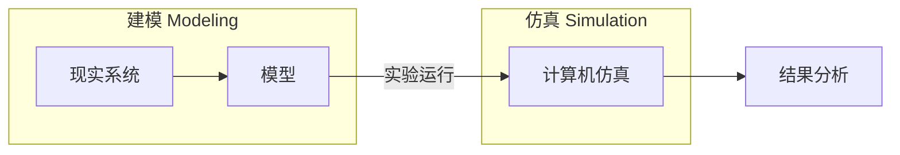
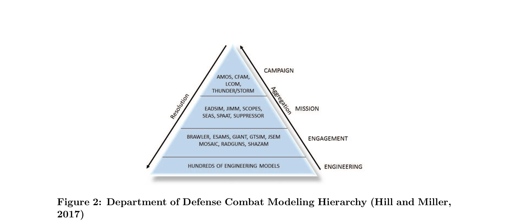

# 什么是仿真

​	仿真是“用虚拟世界代替真实世界做实验”的科学方法，是现代国防、工业、医疗、交通等领域不可或缺的决策支撑工具。

## 通俗定义

​	**仿真（Simulation）** 是利用**计算机**（或其他工具）**构建模型**，来**复现实物系统或设想系统的运行规律**，并在不同条件下进行“虚拟实验”，从而预测系统行为、评估性能、优化设计的一种技术方法。

​	简单说： **现实中做不了、做不起、做不快的实验，就用计算机“模拟”一遍。**

## 核心组成：建模 + 仿真+ 验证确认（M&S + VV&A）

​	**建模（Modeling）** 是对现实或设想系统进行抽象表征的过程。学界经典定义为：

> ​	“**A model is an abstraction of the structure and operating logic of a target system, similar to the prototype yet simplified.**” （模型是对目标系统结构与运行逻辑的抽象，与原型相似但经过简化。）

​	优质模型需在**保真度（Fidelity）**与**复杂度（Complexity）**之间进行合理权衡。工程实践中通常采用“从简到繁、逐步细化”的迭代建模思路。

​	**仿真（Simulation）** 则是在不同输入条件下驱动模型运行试验的过程，用于预测真实系统在各种场景下的表现。与实物试验相比，作战计算机仿真具有**成本低、安全性高、可重复性强**等显著优势，已成为装备论证、战术评估和能力分析的重要替代手段。

> 其实这里还有一个模型验证与确认的概念：
>
> **模型验证与确认（Verification & Validation, V&V）** 是确保仿真结果可信的关键步骤：
>
> - **校核（Verification）**：确认模型是否被正确实现。
>- **验证（Validation）**：确认模型是否准确代表真实系统。 具体方法是在已知输入条件下运行仿真，并将输出结果与真实系统实测数据进行对比。只有通过V&V的模型，其试验结论才具有参考价值。

## 仿真的一般流程

​	一个完整的仿真项目通常遵循以下流程：

1. **需求分析** → 定义问题和评估指标
2. **系统建模** → 建立模型
3. **模型验证确认（VV&A）** → 确保模型可信
4. **试验设计（DOE）** → 科学安排实验参数
5. **运行仿真** → 收集数据
6. **结果分析** → 得出结论、优化方案

​	这一流程为后续所有内容奠定了方法论基础。

# **作战建模的分类体系与层级划分**

​	作战建模是运用数学方法、计算机仿真工具对军事行动进行复现和研究的重要手段，其范围覆盖精细化毁伤仿真、实兵演习验证直至兵棋推演的全谱系。**核心目标**是在保证合理保真度的前提下，输出可靠的分析结论和决策支持。

​	当前，**基于智能体的多智能体仿真（ABMS）** 已成为贴近真实战场复杂规律的主流技术，能够较好地复现实战中的演化趋势与涌现行为。

## 作战模型的主要分类维度

​	根据行业通用标准，作战模型可从多个维度进行分类，这些维度通常组合使用：

| 分类维度     | 类型                   | 说明                                                         |
| :----------- | :--------------------- | :----------------------------------------------------------- |
| **时间特性** | 动态模型               | 系统状态随时间持续演化（最常见）。                           |
| **确定性**   | 随机模型               | 包含概率不确定性（如命中率、环境扰动），军事仿真主流。       |
| **状态更新** | **离散事件仿真 (DES)** | 仅在关键事件触发时更新状态，计算效率高。**AFSIM即采用此类架构**。 |
| **粒度**     | 细粒度 / 粗粒度        | 决定了是看微观细节还是宏观统计。                             |

​	**其中，粒度划分的影响最为显著**，它直接决定了模型所能支撑的指挥决策层级。

## 作战仿真模型的层级划分

​	作战仿真模型是参谋人员分析装备性能与战术优劣的核心工具。按照模型粒度由细到粗，美军及国际主流实践通常将其划分为以下四个层级：

1. **工程级 (Engineering Level)：**
   - **聚焦：** 装备单体物理机理（如弹道、雷达散射截面RCS、电子对抗细节）。
   - **用途：** 装备研制阶段的精细化性能论证。
2. **交战级 (Engagement Level)：**
   - **聚焦：** 单平台或小规模对抗（如1v1空战）。
   - **用途：** 评估单次交战结果（交换比、生存率）。
3. **任务级 (Mission Level)：**
   - **聚焦：** 由多组交战串联的完整任务（如侦察-打击链条）。
   - **用途：** 评估任务整体成败、效能指标（完成率、时间窗口）。
4. **战役级 (Campaign Level)：**
   - **聚焦：** 聚合多轮任务，纳入后勤、兵力调度（如Command“指挥官”系列）。
   - **用途：** 高层战略推演。

> ​	**AFSIM 定位：** AFSIM 主要活跃在 **任务级 + 交战级**，擅长以高效率复现复杂作战场景。

# AFSIM仿真平台

​	AFSIM 是美国军方自主研发的**基于智能体（ABMS）** 作战仿真软件，专注于国防多域、多粒度作战场景构建，尤其擅长任务级与交战级效能分析。

​	**技术基础**：采用 **C++** 开发，基于**离散事件仿真（DES）** 架构。前身为波音公司开发的 **AFNES**（网络化系统分析框架），2013 年 2 月交付美军后，由美国空军研究实验室（AFRL）更名为 AFSIM 并归口管理，现广泛服务于美军及军工体系。

**核心能力**：

- 仿真空域覆盖海平面至近太空，支持多域联合任务效能评估；
- 内置丰富作战平台、子组件预设模型与仿真脚本；
- 全面建模武器弹道、传感系统、电子战、通信组网、目标跟踪融合、自主战术决策、空战指挥软件等。

**研发初衷**：弥补传统军用仿真软件的架构与功能短板，基于现代软件工程理念重构。

**系统组成**：

1. **底层仿真框架库**：核心引擎，提供全局管控、事件调度、地形数据库、坐标转换、DIS 协议支持，并允许自定义各类组件。
2. **集成开发环境（IDE）**：支持高效模型开发调试。
3. **场景可视化分析工具（VESPA）**：用于过程可视化与结果分析。

​	军事仿真重点研究**多智能体交互、不确定性（天气、故障、敌方行为）**和**红蓝体系对抗**，AFSIM 正是在此背景下发挥重要作用。

# ABMS

这里说明一个概念：

​	基于智能体建模仿真（ABMS）----------->Agent-Based Modeling and Simulation

​	它是近十年智能体仿真是建模仿真领域增速最快的分支之一。区别于依托事件调度、随机抽样驱动的离散仿真，ABMS 以单体智能体为建模单元，赋予个体自主决策能力。

## 智能体的行为复杂度谱系

​	**Charles M. Macal**（ABMS 领域知名学者，常与 Michael J. North 合作）将 ABMS 中的智能体按照**行为规则的复杂度**（从简单到复杂）大致分为四类，形成一个连续谱系：

1. **简单反应式 Agent（Simple Reactive Agents）** 仅基于当前感知到的环境状态，采用固定 if-then 规则做出即时反应。没有记忆、没有目标，也没有学习能力。最简单、最易实现，常用于基础物理实体模拟（如简单粒子或固定规则的导弹）。
2. **目标导向/审慎式 Agent（Goal-Directed / Deliberative Agents）** 具备内部目标，能评估多种可能行动并选择最优（或满意）方案。具有一定规划能力，但通常仍基于预定义规则，无显著学习。适用于需要战术选择的战斗机Agent等。
3. **适应性/学习型 Agent（Adaptive / Learning Agents）** 具备记忆功能，能根据过去经验修改自身行为规则或参数（例如强化学习、规则演化）。可在仿真过程中逐步优化策略。适合模拟具有“经验积累”的作战单元。
4. **复杂认知/社会型 Agent（Complex Cognitive / Social Agents）** 最高复杂度，具有高级认知模型（如信念-愿望-意图 BDI 框架）、对其他 Agent 的内部建模、社会规范理解，甚至情感或文化因素。能进行复杂推理、协商与长期适应。常用于高级指挥决策实体或人群行为模拟。

​	Macal 强调，实际 ABMS 项目中的 Agent 通常是**混合型**的，不同类型的 Agent 可共存于同一模型中。复杂度越高，模型的涌现潜力越大，但验证和计算成本也越高。

## 核心思想与传统仿真对比

​	ABMS 是一种自底向上的建模方法。它不直接对整个系统建立全局方程或流程，而是先定义每个个体（Agent）的行为规则，再让大量异质智能体在共享环境中相互交互，从而自然涌现出系统层面的复杂行为和模式（定义个体规则 → 交互 → 自然涌现系统级复杂行为）。其核心逻辑：每一个作战实体内置独立交战规则，个体自主决策、相互作用，最终涌现集群整体作战效果；下级单元继承上级装备通用属性（如战机统一具备飞行、机翼等基础属性）。

​	这里说到ABMS也简单聊一下传统仿真与它做对比：

| 维度           | 传统仿真（整体建模）                              | ABMS（基于智能体）                                           |
| -------------- | ------------------------------------------------- | ------------------------------------------------------------ |
| **建模视角**   | 自顶向下：直接建整个系统方程/流程                 | 自底向上：建每个个体Agent，再让它们互动                      |
| **实体处理**   | 系统级变量、平均值、聚合实体                      | 每个平台/个体都是独立Agent（异质、可追踪）                   |
| **复杂度来源** | 预定义的全局规则/方程                             | 个体局部决策 + 交互 → 涌现复杂性                             |
| **适用场景**   | 连续/流程明确、宏观聚合系统（如流体力学平均模型） | 复杂适应系统、个体异质性强、涌现现象（如战场、交通、社会、经济） |
| **例子**       | 用**微分方程**描述整个战场兵力消耗                | 每架战斗机、每个导弹单独决策和互动                           |

ABMS区别于传统的仿真建模我喜欢一个词：涌现

可以用一个非常典型的军事场景来理解：

想象一场**红蓝双方超视距空战**：

- **传统仿真方式**：中心流程主导一切（探测→分配→发射→评估），实体被动执行，难以灵活加入新交互或环境变化。
- **ABMS 方式**： 你首先定义多种 **Agent**（战斗机Agent具备雷达感知和 BVR 战术决策，导弹Agent具备自主制导逻辑，预警机Agent负责态势共享）。 这些 Agent 在一个真实 **Environment**（包含地形遮蔽、天气影响雷达探测、动态电磁干扰区）中运行。 通过丰富的 **Interaction**（数据链延迟通信、雷达互锁、导弹与目标的对抗制导、电子战相互压制），系统在多次仿真中自然**涌现**出：红方“诱饵+主力后手夹击”的协同战术、蓝方因通信延迟导致的误判、电子战压制后突然的低空突防等复杂行为。

​	这些现象并非预先写死在中央流程中，而是 Agent 在特定环境下的局部决策与交互共同涌现的结果。这正是 ABMS 更贴近真实战场复杂性与不确定性的根本原因。

## ABMS 的三大组成

ABMS 由**Agent（智能体）**、**Interaction（交互）**、**Environment（环境）** 三大核心要素共同构成，缺一不可。以下结合红蓝空战场景说明：

- **Agent（智能体）** 系统的基本单元，具有自主性、感知能力和决策能力。 示例：战斗机、导弹、预警机、电子战飞机、地面雷达等。每个 Agent 都独立运行“感知—决策—行动”循环。
- **Interaction（交互）** Agent 之间以及 Agent 与环境之间的动态关系，是涌现发生的关键。 示例：数据链通信、雷达探测与跟踪、导弹攻击与制导、协同战术配合、电子战干扰等。这些交互可以是实时的、带延迟的，甚至是不对称的。
- **Environment（环境）** Agent 所处的共享外部世界，为所有 Agent 提供感知对象和行动约束。 示例：战场地形（山脉、城市）、气象条件（云层、风向）、电磁环境（干扰区）、威胁区（防空阵地）、空域限制等。环境既可以是静态的，也可以是动态变化的（如实时更新的电磁态势）。

​	ABMS 必须同时强调三大组成。Agent 是核心载体，Interaction 是涌现的动力，Environment 是舞台，三者共同作用才能真正体现 ABMS 的优势。

#  智能体自主等级与参考架构

## Sheridan 10 级自主分级模型

​	为了定义智能体的“智商”，行业通用**谢里丹（Sheridan）10 级自主分级模型**，从**人类介入度、机器自主度**双维度划分自主等级：

| 等级 |               能力说明               |
| :--: | :----------------------------------: |
|  1   |     无计算机辅助，全流程人工操作     |
|  2   |      计算机给出全部可选行动方案      |
|  3   |     计算机精简备选方案至少数几项     |
|  4   |      计算机单独推荐一套行动方案      |
|  5   |      方案需人工确认后计算机执行      |
|  6   | 人工拥有限时否决权，超时系统自动执行 |
|  7   |    系统自动执行，事后必须向人汇报    |
|  8   | 系统自动执行，仅在人类问询时上报结果 |
|  9   |   系统自主决定是否向人反馈行动结果   |
|  10  |   全自主决策作战，完全无视人类指令   |

- **L0-L4 (辅助)：** 计算机提供建议，人工决策。
- **L5-L7 (半自主)：** 系统执行，人工拥有否决权或事后汇报。
- **L8-L10 (全自主)：** 系统自主决定是否反馈结果，完全无视人类指令（最高级）。

##  自主系统参考架构 (ASRA)

​	为规范自主系统设计，引入 **Autonomous Systems Reference Architecture (ASRA)**（基于 MBSE，最经典实现为 HAMR 多机器人混合架构），共分为四层：

1. **控制层 (Controller Layer)**：底层执行官，直接控制运动与原子动作。
2. **时序调度层 (Sequencer Layer)**：行为编排师，串联动作序列，处理中断与状态跳转。
3. **慎思决策层 (Deliberator Layer)**：高层指挥官，基于态势进行推理与规划（常用强化学习或规则引擎）。
4. **协同调度层 (Coordinator Layer)**：多兵种联络官，负责任务分配与信息交互，支持从单智能体到深度协同等多种模式。

> 协同模式示例:
>
> - **单智能体模式**：独立完成任务（单打独斗）。
> - **基础协同模式**：简单分工，如分区搜索。
> - **深度协同模式**：动态交互，如发现目标后呼叫友军核验或联合火力打击。
> - **适度协同模式**：基于价值函数或效用评估，动态决定是否响应其他 Agent 的请求，避免过度通信。

​	在 ABMS 中，智能体的设计可从多个维度展开。Macal 的四类划分帮助我们理解 Agent 的认知复杂度；Sheridan 10 级模型则定义了其自主程度；而 ASRA 参考架构为实现上述能力和自主等级提供了工程化的分层结构。三者共同构成了构建高保真作战 Agent 的完整方法论。

# 离散事件仿真（DES）

​	离散事件仿真仅在**特定离散事件触发瞬间**更新系统状态；相比连续仿真时间粒度更粗，但实现难度更低，落地应用场景广泛。

​	离散仿真核心假设：**系统状态仅由离散事件驱动瞬时跳变，相邻两个事件的间隔时段内系统无任何状态变化**。

​	典型示例：计算机网络，数据包发送开始、数据包发送结束、超时重传触发均为独立事件，两个事件中间链路无关键状态变更；交通信号灯系统同理，红 / 黄 / 绿切换瞬间改变周边车流行为，信号灯维持某一色灯期间系统状态恒定。

DES 依托 **未来事件集 FES（Future Event Set）** 循环调度推进仿真：

1. **初始化**：构建模型数据结构、执行用户自定义初始化逻辑，向 FES 写入首批触发事件，启动仿真；
2. **事件循环**：严格按照时间戳先后顺序从事件队列取出事件执行（保证因果性，后置事件不能反过来影响已发生的前置事件）；执行事件时调用建模者自定义业务代码（例如网络超时事件触发数据包重发、更新重试计数、编排下一次超时事件）；
3. **仿真终止**：事件队列为空、仿真时钟 / CPU 耗时达设定上限、统计指标收敛至预设精度，任一条件满足即停止仿真。

​	DES 已在多领域落地：医疗放疗排班优化、医院临床流程改进、生产装配线优化、系统优化算法验证等方向均有成熟应用。

# 试验设计（DOE）

​	试验设计（Design of Experiments, DOE）是支撑仿真量化分析的统计学基础，完整流程包含：筛选影响因子与评估指标、设计高效采样方案、执行仿真试验、统计分析数据并推导因子与结果的因果关系。所有含随机变量的仿真系统均可采用 DOE 分析，常用方案包含全因子试验、部分因子试验、中心复合设计、拉丁超立方填充设计。

​	试验设计通过人为调控输入变量，量化输入与输出指标间的因果关联，依托试验数据提炼关键影响因子、构建系统预测模型。

​	仿真不是跑一次就结束，我们需要通过 **试验设计 (DOE)** 来量化分析不同因素的影响。

- **核心问题：** 导弹数量、通信距离、自主等级等因素都会影响结果。哪个是关键因素？
- **DOE 的作用(核心任务)：** 设计实验方案、统计分析数据、寻找关键因子与结果的因果关系。
- **常用方法：**
  - **全因子/部分因子试验：** 遍历所有可能组合（大部分仿真实验常用）。
  - **拉丁超立方抽样 (LHD)：** 均匀抽样，适合高维空间。
  - **最大投影试验设计：** 在因子数量较少时，空间填充能力优于LHD。**（推荐用于精确采样）**

# **结语**

​	本文介绍了仿真的基础逻辑、AFSIM 的内核机制以及构建智能体的 ASRA 架构。理解这些理论是驾驭 AFSIM 进行高级开发（如接入强化学习、构建数字孪生）的基石。