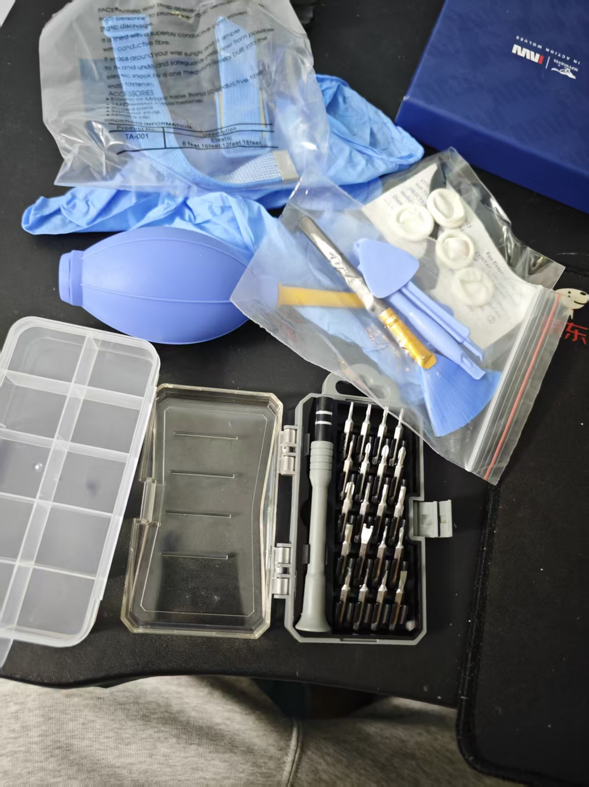
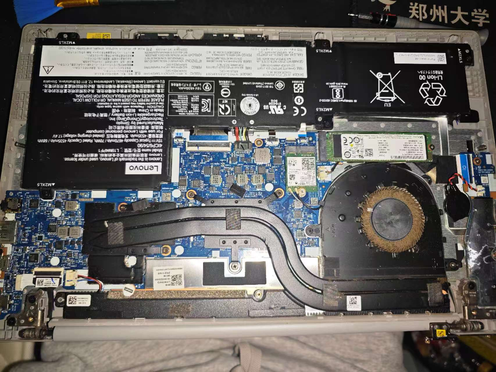
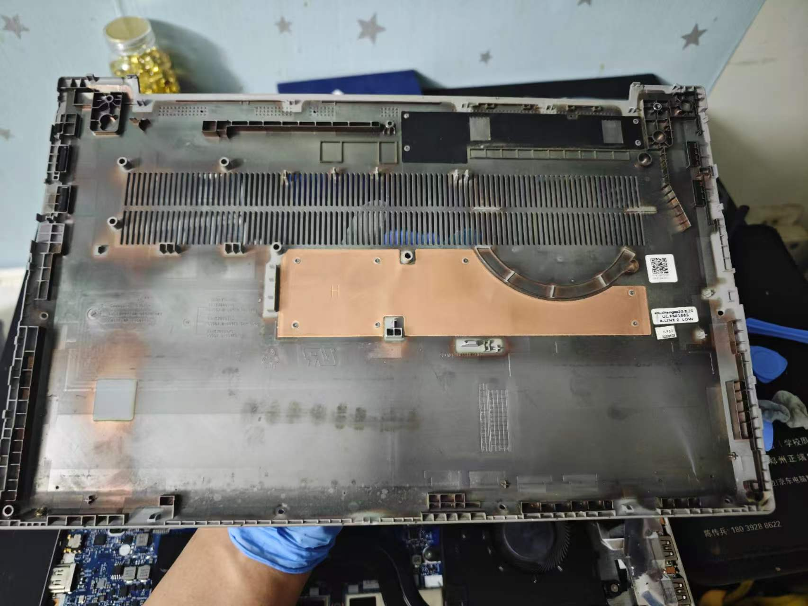
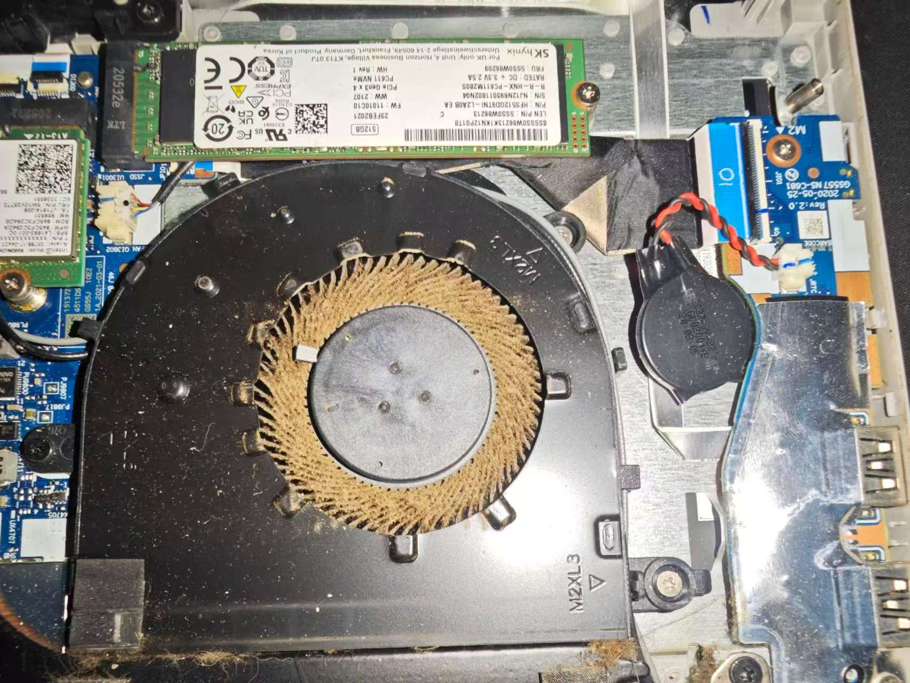
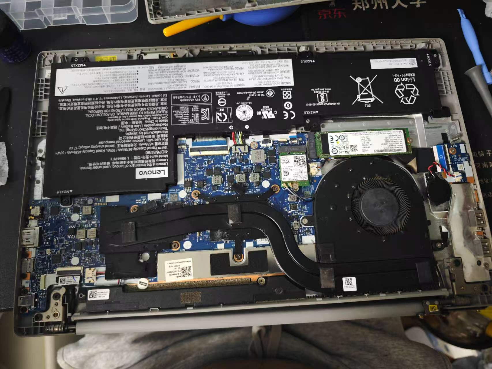
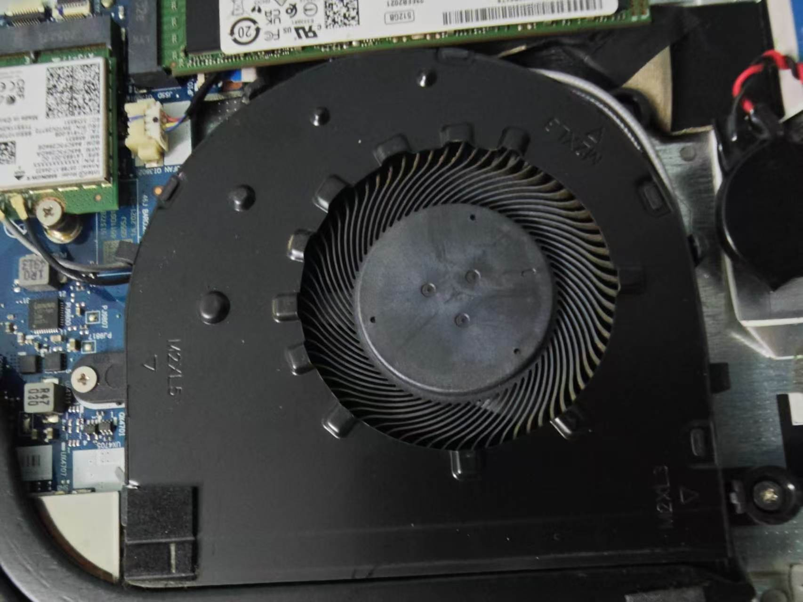

# 新电脑的选择

​	本来是想配一个台式机，看了好多天也问了很多人，最终决定买一个游戏本，因为对于我现在来说，便携性还是很重要的，而且对于租房阶段的我来说，空间和时间上游戏本更适合我。

# 旧电脑的清理

​	旧电脑还能用，还够用，我就在暂且当作工作中的摆渡机来用，平常折腾什么东西也就在这台电脑上进行。由于运行什么软件都电脑温度高高的，所以我决定了自己清理灰尘，并清换硅脂。

​	在网上买来了一套拆笔记本工具，很好用，也很便宜，20元左右。

​	开始拆笔记本，小心翼翼地拆，拆出来发现好脏，由于我用了四五年没有清理灰尘，是有自己的预期的，也没有很惊讶😄。

​	风扇确实该好好清理一下了，但我没想到吹完灰尘效果会这么好：

​	放个近照~

然后拆装散热器，换硅脂。忙完这些得有四十分钟，好累😩。
